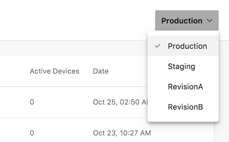
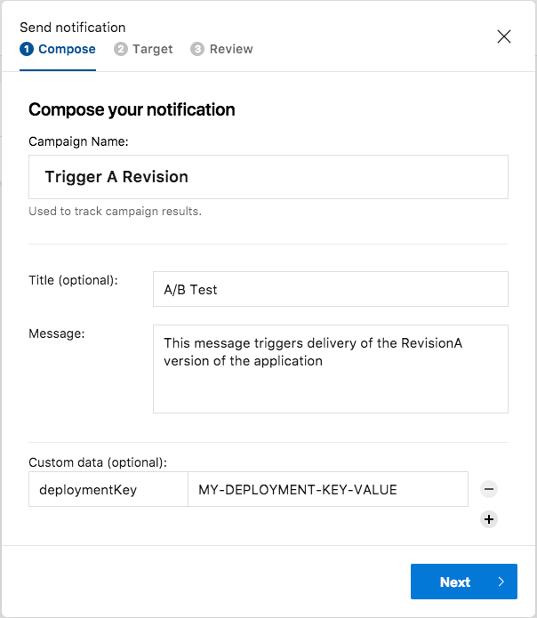
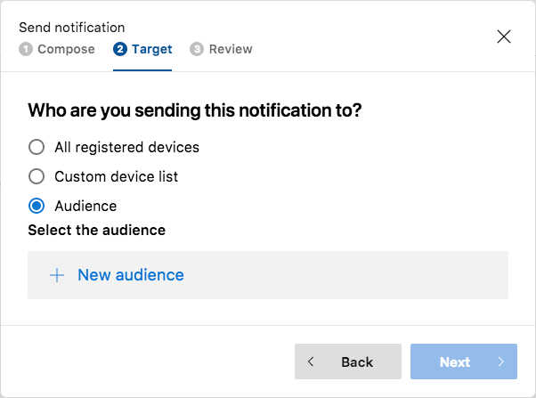
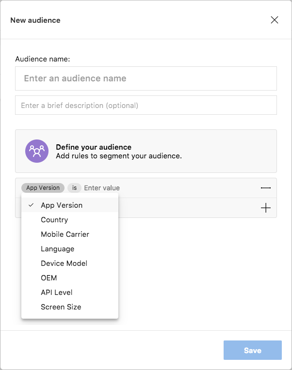

# Visual Studio App Center: Delivering A/B Testing for React Native Apps
This repository contains the project source code for my ReactiveConf 2017 session.  My session, *Creative Hacking: Using Code Push for React Native A/B Testing*, demonstrated how to use several Visual Studio App Center (VSAC) features (Analytics, CodePush, and Push) to implement A/B testing in a React Native application.

## Using Analytics & Crash to Understand User Behavior

As you build the A/B variants of your app, you'll need some way to determine how or how well the app is used by the app users.

Start by implementing VSAC Crashes to your application. With this in place, you'll know whenever the app crashes and gather additional information you'll need to troubleshoot and fix the application. Since we're experimenting with new versions of the app, there's no guarantee all the bugs are gone, so this extra level of protection is important. Refer to the [Visual Studio App Center Crashes Documentation](https://docs.microsoft.com/en-us/appcenter/crashes/) for details on how to add Crashes support to your application.

Next, VSAC Analytics capabilities to track users' activity in your app, with all information visualized in VSAC Analytics dashboard to make it easy to see trends or identify gaps. This provides you with invaluable information about your user's experience with the app.

Using the App Center Analytics SDK, you define custom events (depending on your app, this can range from identifying which menu choices are made to tracing a user's path through the app) in your app to understand how users use different features, where they're successful, and where they get stuck, so you make informed decisions about which version works better. Refer to the [Visual Studio App Center Analytics Documentation](https://docs.microsoft.com/en-us/appcenter/analytics/) for details on how to add Crashes support to your application and report custom events in your app's code.

## Publishing Multiple App Revisions to CodePush

After adding VSAC Crashes and Analytics support to your application, deploy the base version of the React Native app to CodePush using the following command:

	code-push release-react <app-name> <target-platform>
	
Replace `<app-name>` with the encoded name for your VSAC app. By encoded name, the app name as it appears in any VSAC URLs. Essentially, this means replacing any spaces with the dash (`-` character. Replace `<target-platform>` with the target platform for the app (Android, iOS, Windows, etc). In my example case, I used the following command:

	code-push release-react MyApp android

Next, use the CodePush CLI to create new CodePush deployments for your app. By default, App Center creates Production and Staging deployments for your app. The **Production** deployment hosts the default version of the app, the one that everyone gets when they download the app from an app store or when a beta version is deployed using App Center. The **Staging** deployment is the home the test versions of your app. For our purposes, you'll need one or more additional deployments (for the "A" & "B" variants of your app). 

For my demo, I created RevisionA and RevisionB deployments to use for the A and b versions of my app. To do this, use the CodePush CLI `code-push deployment add` command, passing in the name of the app, plus the name of the deployment you'd like to create. For example, if my project is called MyApp, to create a RevisionA deployment, I'd use: 

	code-push deployment add MyApp RevisionA
	code-push deployment add MyApp RevisionB

When the CLI finishes creating the Deployment, it will display some content in the terminal window:

	Successfully added the "RevisionA" deployment with key "THIS-APP'S-DEPLOYMENT-KEY" to the "MyApp" app.

You're going to need the deployment key displayed in that output later in this process, so take a moment and record the key for each new deployment before continuing. I'll show you later how to find this value using the CLI, but you'll save some work recording the values now.

When you're done, the deployments list in App Center will list the additional deployments.

 
Now, create the different revisions of the app using whatever source control mechanism that works for you. Usually you'll just put them into different branches in your code repository. With those in place, publish each revision to its own CodePush Deployment in VSAC. For my example app, I published the RevisionA variant of the app to CodePush using the following command:

	code-push release-react MyApp android --d RevisionA

## Triggering A/B Testing Using Push

### Push Processing Code

The project's `app.js` file contains the client-side implementation for A/B testing. The app supports Push through the following import:

	import Push from 'appcenter-push';

Next, the app uses a constant to store the deployment key for the base version of the application (not either of the A/B revisions):

	const DEFAULT_KEY={deploymentKey: "PUT YOUR BASE DEPLOYMENT KEY HERE"};

To get the deployment key, open a terminal window and execute the following command:

	code-push deployment ls MyApp -k

From the command's output, grab the `Production` deployment key.

On app startup, the app's `constructor` code checks to see if there's a deployment key stored in the device's async storage repository. If it finds a key, it uses that key to initiate a CodePush `sync` to pull down the latest version of whatever revision of the app its supposed to be using. If it doesn't find the key in storage, or if retrieving the key from storage fails, it uses the default key stored in the `DEFAULT_KEY` constant.

	constructor(props){
	    super(props);

	    AsyncStorage.getItem('deploymentKey').then((value) => {
	      if (value !== null){
	        console.log("Deployment key:", value);
	        CodePush.sync({"deploymentKey": value});        
	      } else {
	        console.log("Using default deployment key");
	        CodePush.sync(DEFAULT_KEY);
	      }
	    }).catch((err)=>{
	      console.error("Error reading Async Storage:", err.message);
	      console.log("Using default deployment key");
	      CodePush.sync(DEFAULT_KEY);  
	    });    
	  
	    // Now tell everyone we're initialized
	    Analytics.trackEvent("App initiated", { version: "CORE" });
	    // Analytics.trackEvent("App initiated", { version: "A" });
	    // Analytics.trackEvent("App initiated", { version: "B" });    
	}

**Note:** At the bottom of the `constructor`, the calls to `Analytics.trackEvent()` send an event notification to VSAC Analytics indicating which version of the app is running on this device. Uncomment the line that aligns with the version of the application you're working with (commenting out the other lines).

That takes care of the startup process, the app must still respond to push notifications; this is done through the `setEventListener` code shown below. The event fires every time the app receives a push notification, and pulls the deployment key from the notification message then uses it to initiate a CodePush `sync` to get a new revision of the application.

	Push.setEventListener({
	  pushNotificationReceived(pushNotification) {
	    // Use these to display a message to the user if required
	    let {message, title} = pushNotification; 
	    console.log(`Notification received: ${title} - ${message}`);
	    
	    let deploymentKey; 
	    if (pushNotification.customProperties && Object.keys(pushNotification.customProperties).length > 0) {
	      deploymentKey = pushNotification.customProperties.deploymentKey;
	      if (deploymentKey) {
	        console.log(`Deployment key: ${deploymentKey}`);
	        // Store the deployment key in Async Storage. Use this in the codepush.sync 
	        // call if you use CodePush when the app starts up. 
	        AsyncStorage.setItem('deploymentKey', deploymentKey);        
	        // You may also want to removeItem from asyncStorage to clear the A/B test 
	        //and revert to original version of the app. 
	        if (AppState.currentState === 'active') {
	          CodePush.sync({deploymentKey});
	        } else {
	          // Sometimes the push callback is received shortly before the app is fully 
	          // active in the foreground. Since we store the deployment key in AsyncStorage,
	          // CodePush sync will be called when the app starts again, and the A/B test 
	          // will run.
	        }
	      }          
	    }
	  }
	});

### Sending a Trigger Push Notification

With your A and B versions completed and ready to deploy, you're ready to use App Center's Push service to trigger app deployments and get your "experimental" apps into your users' hands. To do this, create a push notification containing a custom data object referencing the revision version's Deployment ID and send it to a subset of your app's users.
 
To get the deployment key, open a terminal window and execute the following command:

	code-push deployment ls MyApp -k

The command's output will list the deployment key for each of your defined deployments, grab the one for the particular revision you want deployed.

To send the push notification, open the VSAC Dashboard and select your application project. Select **Push** from the project's navigation pane. The first time you do this, App Center will walk you through the process of setting up the third-party push services (Google, Apple, etc.) used to deliver messages to devices. Once you've completed that initial setup, open the **Notifications** panel, then click the **Send Notification** button to create a new notification. 

On the **Send Notification** form that appears, populate the **Campaign Name**, **Title**, and **Message** fields as needed. Since the push notification is handled automatically by the app, the user will never see these values displayed anywhere. In the **Custom data** list displayed on the bottom of the form, click the **+** button to add a new data key/value pair. Using the following figure as a guide, enter a key of `deploymentKey` and the Deployment Key as the `value`. Be sure to use the Deployment key for the particular revision of the app you want deployed. Click the **Next** button to continue.

Push can send notifications to all registered devices, a specific list of devices, or, using the **Audiences** feature, to all devices that match specific properties. In the **Target** pane, select **Audience**, then click the **New Audience** option.

In the **New audience** panel, populate the form with an appropriate **Audience name** and **description**, then use audience rules at the bottom of the form to define one or more criteria Push will use to identify targets for the push notification. Click the **Save** button when you're done. Back at the **Send Notification** panel, click the **Next** button 

## Afterwards

When you're done A/B testing and want to reset your app to its default content, simply push the Deployment ID for the Production deployment to the same audience. You can also switch all users to the winning app version  by pushing the Deployment ID for the winning version to all users.
